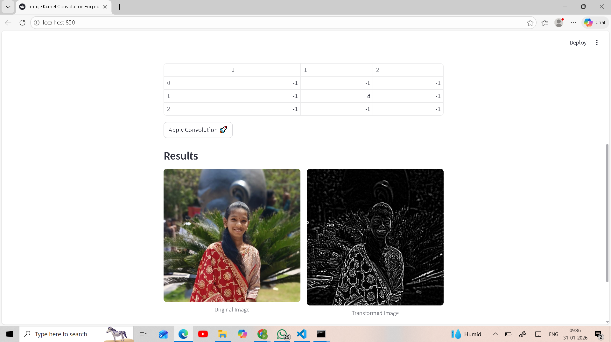
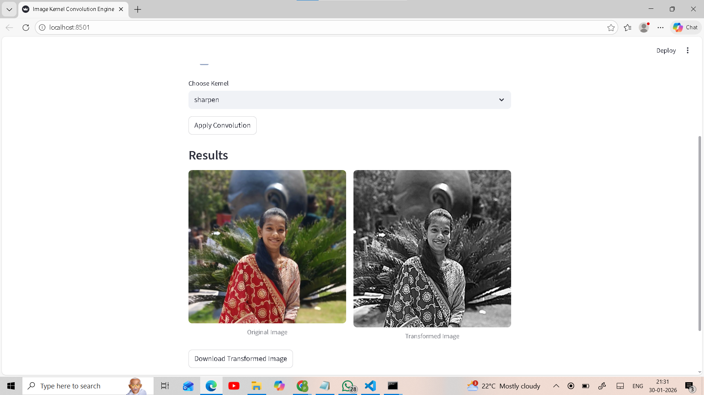
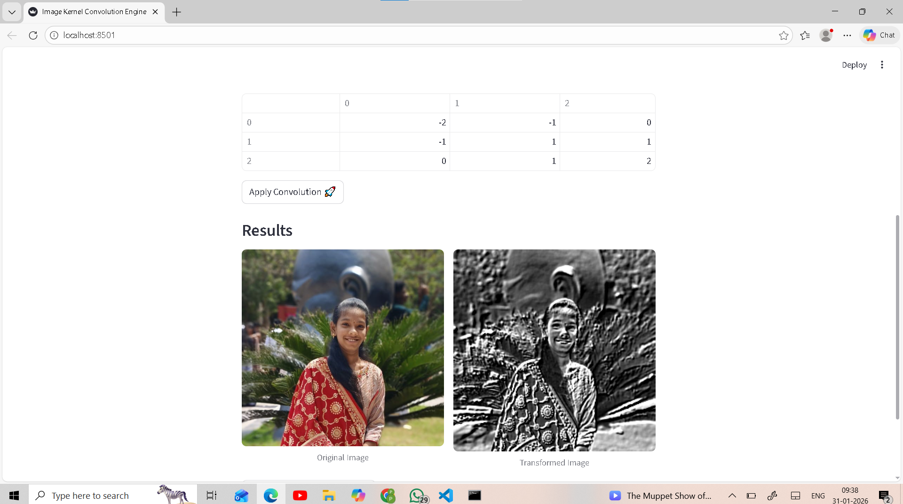
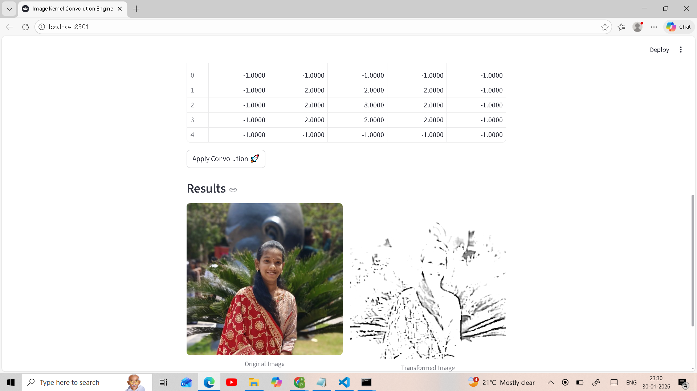
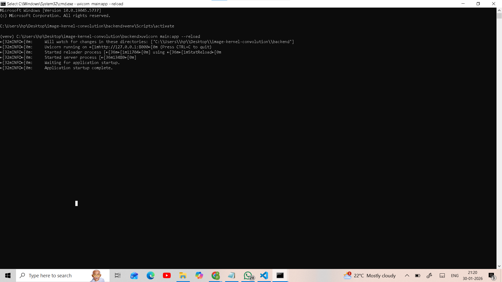
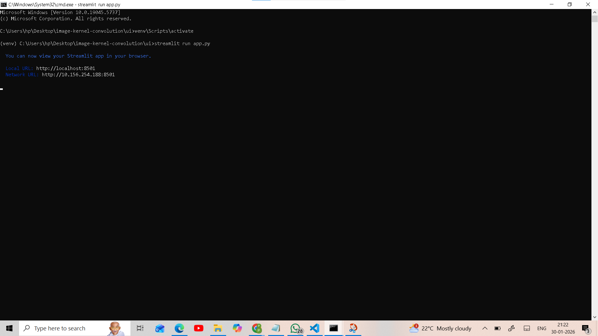

# Image Kernel Convolution Engine

## Overview
This project is a backend-focused image processing system that applies convolution kernels to images.
The convolution algorithm is implemented **from scratch using NumPy**, demonstrating a clear
understanding of image processing fundamentals.

The system consists of:
- A FastAPI backend for image transformation
- A Streamlit-based UI for interactive visualization

---

## Project Structure
```text
image-kernel-convolution/
├── backend/
│ ├── main.py # FastAPI application entry point
│ ├── convolution.py # Manual convolution logic (NumPy)
│ ├── kernels.py # Predefined convolution kernels
│ ├── requirements.txt # Backend dependencies
│ └── venv/ # Virtual environment (ignored by git)
│
├── ui/
│ ├── app.py # Streamlit user interface
│ ├── requirements.txt # UI dependencies
│ └── venv/ # Virtual environment (ignored by git)
│
├── screenshots/
│ ├── home_page.png
│ ├── upload_photo.png
│ ├── convolution_blur.png
│ ├── convolution_edge.png
│ ├── convolution_sharpen.png
│ ├── convolution_emboss.png
│ ├── convolution_custom.png
│ ├── backend.png
│ └── ui.png
│
├── .gitignore # Git ignore rules (venv, cache, etc.)
└── README.md # Project documentation
```
---

## Features
- Upload images (PNG, JPG, JPEG)
- Apply **pre-built convolution kernels**:
  - Blur
  - Sharpen
  - Edge Detection
  - Emboss
- Apply **custom user-defined convolution kernels (3×3 and 5×5)**
- Convolution logic implemented manually (no OpenCV or high-level filters)
- Visual pipeline: **Original Image → Kernel Matrix → Transformed Image**
- Side-by-side comparison of original and processed images
- Download transformed image

---

## Tech Stack
- Python
- FastAPI
- NumPy
- Pillow (PIL)
- Streamlit

---

## How Convolution Works
Convolution involves sliding a kernel (small matrix) over an image and computing weighted sums
to extract features such as edges, textures, or smoothing effects.

- Supports **3×3 and 5×5 kernels**
- Larger kernels capture wider spatial context
- Edge padding is used to handle image borders
- Images are resized to **256×256** for consistent performance

---

## Setup Instructions

### Backend
```bash
cd backend
python -m venv venv
venv\Scripts\activate
pip install -r requirements.txt
uvicorn main:app --reload

cd ui
python -m venv venv
venv\Scripts\activate
pip install -r requirements.txt
streamlit run app.py

```
## Screenshots

### Homepage


### Upload Image


### Convolution Results

**Blur**


**Edge Detection**


**Sharpen**


**Emboss**


**Custom**


### Backend & UI Terminals


